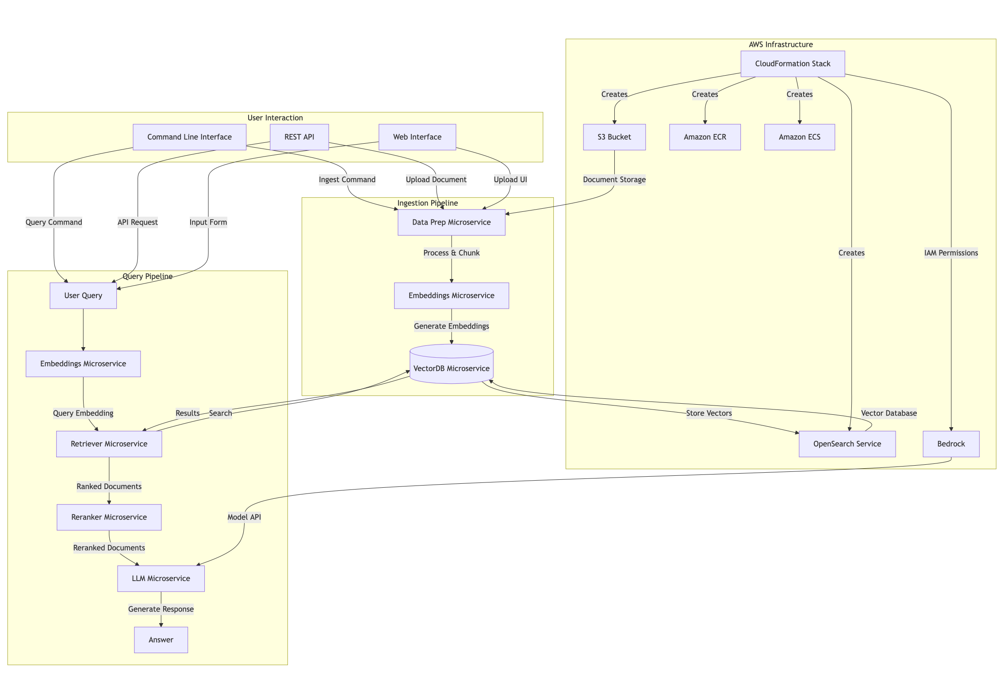

# Enterprise-Grade GenAI with OPEA on AWS

This repository contains a complete implementation of an enterprise-grade RAG (Retrieval Augmented Generation) system using the Open Platform for Enterprise AI (OPEA) ChatQnA example, deployed on AWS EKS.

## Overview

OPEA ChatQnA demonstrates a production-ready implementation of the RAG architecture, which combines the benefits of knowledge bases with the power of large language models to generate accurate, contextual, and up-to-date responses.



## Features

- **End-to-End RAG Pipeline**: Complete implementation of the retrieval augmented generation architecture
- **Microservices Architecture**: Modular components that can be independently scaled and updated
- **Vector Search**: Semantic search capabilities for document retrieval
- **Enterprise Security**: Guardrails to ensure safe and compliant responses
- **Monitoring**: Comprehensive metrics and dashboards with Prometheus and Grafana
- **Cloud-Native**: Fully deployed on AWS with Kubernetes orchestration
- **Multiple Vector DB Options**: Support for both Redis Vector DB and OpenSearch
- **LLM Flexibility**: Support for both open-source models (via TGI) and AWS Bedrock

## Components

The implementation includes the following key components:

1. **Data Preparation Service**: Processes and chunks documents for ingestion
2. **Embedding Service**: Converts text to vector embeddings
3. **Vector Database**: Stores document embeddings (Redis or OpenSearch)
4. **Retrieval Service**: Searches for relevant content based on queries
5. **Reranking Service**: Refines and prioritizes retrieved content
6. **LLM Service**: Generates human-like responses (TGI or AWS Bedrock)
7. **Gateway**: Orchestrates the flow between components
8. **UI**: Web interface for interacting with the application

## Prerequisites

- AWS CLI installed and configured
- kubectl installed
- Python 3.8+ with pip
- Git

## Getting Started

Follow these steps to deploy the complete solution:

### 1. Clone the repository

```bash
git clone https://github.com/yourusername/Enterprise-Grade-GenAI-with-OPEA-on-AWS.git
cd Enterprise-Grade-GenAI-with-OPEA-on-AWS

2. Deploy infrastructure
bash./scripts/deploy-infrastructure.sh
This will create an EKS cluster and all necessary AWS resources.
3. Deploy the application
For the basic implementation:
bash./scripts/deploy-all.sh
For the complete implementation with all customizations:
bash./scripts/deploy-complete.sh
4. Upload sample data
bash./scripts/upload-sample-data.sh
5. Access the application
After deployment, you'll receive URLs for:

The ChatQnA UI
The Grafana dashboard (credentials: admin/admin)

Customizations
This implementation includes several customizations that demonstrate enterprise capabilities:
1. Guardrails
Added content moderation and safety features to ensure appropriate use:
bash./scripts/deploy-guardrails.sh
2. OpenSearch Integration
Replaced the default Redis Vector DB with OpenSearch for enhanced scaling and features:
bash./scripts/deploy-opensearch.sh
3. AWS Bedrock Integration
Used AWS Bedrock's Claude model instead of the default TGI service:
bash./scripts/deploy-bedrock.sh
Monitoring
The deployment includes comprehensive monitoring with Prometheus and Grafana:

Metrics Collection: Response times, request rates, error rates
Dashboards: Pre-configured Grafana dashboards for visualizing performance
Alerts: Sample alert configurations for production monitoring

Cleanup
To remove all deployed resources and avoid AWS charges:
bash./scripts/cleanup.sh
Architecture Details
For detailed information about the architecture and components, see:

Architecture Overview
Implementation Details
Customization Guide
